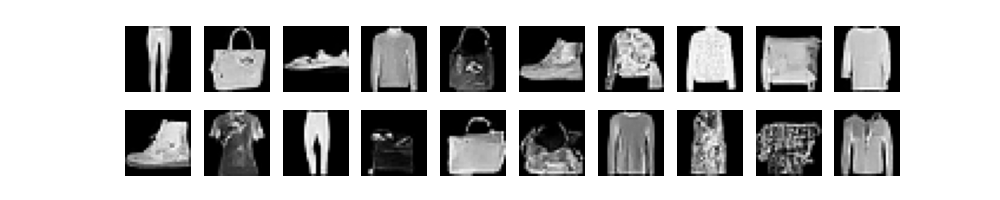

# 2024_urulab_seminer
Fashion-MNISTデータセットを用いたUNetベースの拡散モデルのトレーニングと、訓練済みモデルを使用した画像の生成

## 使い方 (Colab)

これを開いて順番に実行<br>
[](https://colab.research.google.com/drive/18w8SG33xgdU3CgK_5YKxuMsWuNnJ9HD9?usp=sharing) 


## 使い方 (ローカル)
### 依存関係のインストール
```
poetry install

### 実行
トレーニング
```
poetry run python diffusion_model_demo.py
```
エポックごとの生成結果の保存と比較
```
poetry run python generate_image.py
```

### 結果
